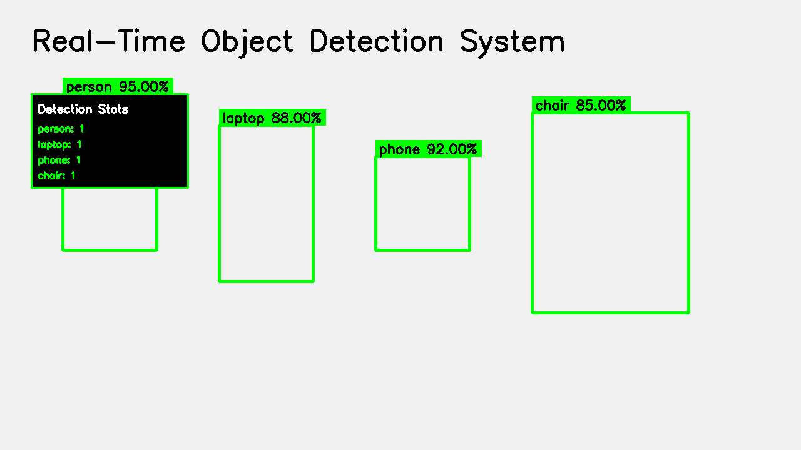

# 🎯 GitHub Setup Checklist

Complete checklist for creating a portfolio-ready GitHub repository.

## ✅ Pre-Publish Checklist

### 1. Code Quality
- [ ] All code runs without errors
- [ ] Remove any hardcoded credentials or API keys
- [ ] Remove debug print statements
- [ ] Add proper error handling
- [ ] Code follows style guidelines (PEP 8)
- [ ] Add docstrings to all public functions

### 2. Documentation
- [ ] README.md is complete and accurate
- [ ] QUICKSTART.md exists
- [ ] ARCHITECTURE.md exists
- [ ] DEPLOYMENT.md exists
- [ ] LICENSE file included
- [ ] CONTRIBUTING.md included
- [ ] All example code works

### 3. Repository Structure
- [ ] .gitignore file present
- [ ] requirements.txt accurate
- [ ] All necessary directories created
- [ ] Remove any test/temp files
- [ ] GitHub templates in .github/ directory

### 4. Visual Content
- [ ] Run `python generate_screenshots.py`
- [ ] Screenshots added to screenshots/ folder
- [ ] Screenshots referenced in README
- [ ] Architecture diagram included
- [ ] (Optional) Create demo GIF

### 5. Metadata
- [ ] Repository name is descriptive
- [ ] Repository description is clear
- [ ] Topics/tags added
- [ ] Default branch is 'main'
- [ ] Repository is public

---

## 📝 Step-by-Step Setup Guide

### Step 1: Local Repository Setup

```bash
# Initialize git (if not already done)
cd object-detection-system
git init

# Add all files
git add .

# First commit
git commit -m "Initial commit: Real-time object detection system"
```

### Step 2: Create GitHub Repository

1. Go to https://github.com/new
2. Repository name: `object-detection-system`
3. Description: `Production-ready real-time object detection with YOLOv8, featuring web dashboard, alerts, and analytics`
4. Public repository
5. **Do NOT initialize with README** (you already have one)
6. Click "Create repository"

### Step 3: Connect Local to GitHub

```bash
# Add remote
git remote add origin https://github.com/YOUR_USERNAME/object-detection-system.git

# Push to GitHub
git branch -M main
git push -u origin main
```

### Step 4: Repository Settings

#### A. General Settings
- [ ] Repository name: `object-detection-system`
- [ ] Description: Clear and concise
- [ ] Website: Add deployment link if available
- [ ] Topics: Add relevant tags

**Recommended Topics:**
```
computer-vision
yolov8
object-detection
opencv
python
streamlit
real-time
machine-learning
deep-learning
portfolio-project
```

#### B. Features
- [ ] ✅ Issues enabled
- [ ] ✅ Discussions (optional, for community)
- [ ] ❌ Wiki (not needed, you have docs)
- [ ] ❌ Projects (not needed for now)

#### C. Security
- [ ] Enable vulnerability alerts
- [ ] Enable automated security updates

### Step 5: README Enhancement

Update your README.md with:

#### Badges at the top:
```markdown


```

#### Demo GIF (after creating it):
```markdown
## 🎬 Demo


```

#### Screenshots:
```markdown
## 📸 Screenshots

### Detection in Action


### Web Dashboard


### Analytics

```

### Step 6: Create Releases

#### First Release (v1.0.0)

```bash
# Tag your first release
git tag -a v1.0.0 -m "Initial release"
git push origin v1.0.0
```

Then on GitHub:
1. Go to "Releases"
2. Click "Draft a new release"
3. Choose tag: v1.0.0
4. Release title: `v1.0.0 - Initial Release`
5. Description:

```markdown
## 🎉 Initial Release

Production-ready real-time object detection system with comprehensive features.

### Features
- ✅ Real-time detection with YOLOv8
- ✅ Object counting and statistics
- ✅ Automated CSV logging
- ✅ Alert system (console + email)
- ✅ Web dashboard with Streamlit
- ✅ Analytics and reporting
- ✅ Docker support
- ✅ Comprehensive documentation

### Installation

```bash
git clone https://github.com/YOUR_USERNAME/object-detection-system.git
cd object-detection-system
python setup.py
```

### Quick Start

```bash
# CLI application
python app.py

# Web dashboard
streamlit run dashboard.py
```

### Documentation
- [Quick Start Guide](QUICKSTART.md)
- [Deployment Guide](DEPLOYMENT.md)
- [Architecture](ARCHITECTURE.md)
- [Contributing](CONTRIBUTING.md)

---

**Full Changelog**: Initial release
```

6. Click "Publish release"

### Step 7: About Section

In the repository's "About" section (top right):

```
Description:
Production-ready real-time object detection with YOLOv8, featuring 
web dashboard, alerts, and analytics. 99.7% storage reduction vs 
traditional video recording.

Website:
[Your deployment link if available]

Topics:
computer-vision, yolov8, object-detection, opencv, python, 
streamlit, real-time, machine-learning, deep-learning
```

### Step 8: Pin Repository

1. Go to your GitHub profile
2. Click "Customize your pins"
3. Select this repository
4. Rearrange to show near the top

---

## 🎨 Visual Enhancements

### Create Demo GIF

**Option 1: Use ScreenToGif (Windows)**
1. Download ScreenToGif
2. Run your detection system
3. Record 10-20 seconds
4. Export as GIF
5. Save to `screenshots/demo.gif`

**Option 2: Use ffmpeg (Linux/Mac)**
```bash
# Record screen
ffmpeg -video_size 1280x720 -framerate 25 -f x11grab -i :0.0 output.mp4

# Convert to GIF
ffmpeg -i output.mp4 -vf "fps=10,scale=800:-1" screenshots/demo.gif
```

**Option 3: Use LICEcap (Free, cross-platform)**
1. Download LICEcap
2. Record your detection demo
3. Save to screenshots/demo.gif

### Optimize Images

```bash
# Install imagemagick
sudo apt-get install imagemagick

# Optimize PNGs
mogrify -strip -quality 85 screenshots/*.png

# Reduce GIF size
gifsicle -O3 --lossy=80 screenshots/demo.gif -o screenshots/demo_optimized.gif
```

---

## 📢 Promotion Checklist

### Social Media
- [ ] Post on LinkedIn (use template from SOCIAL_MEDIA_TEMPLATES.md)
- [ ] Tweet about it (thread format)
- [ ] Share in relevant Discord servers
- [ ] Post in Reddit (r/Python, r/computervision, r/learnprogramming)
- [ ] Share on Dev.to

### Communities
- [ ] Hacker News (Show HN)
- [ ] Product Hunt (optional)
- [ ] LinkedIn groups
- [ ] Facebook developer groups

### Portfolio
- [ ] Add to personal website
- [ ] Add to resume
- [ ] Update LinkedIn projects section
- [ ] Add to GitHub profile README

---

## 🏆 Quality Checklist

### GitHub Profile

**Does your README have:**
- [ ] Clear project description
- [ ] Badges (Python version, license, etc.)
- [ ] Screenshots/demo GIF
- [ ] Features list
- [ ] Quick start guide
- [ ] Installation instructions
- [ ] Usage examples
- [ ] Documentation links
- [ ] Contribution guidelines
- [ ] License information

**Professional touches:**
- [ ] Proper grammar and spelling
- [ ] Consistent formatting
- [ ] Working links
- [ ] Up-to-date information
- [ ] Professional tone

---

## 📊 Analytics (Optional)

### Track Repository Stats

**Add GitHub stats to your profile README:**

```markdown

```

**Track downloads:**
- Use shields.io for download badges
- Google Analytics for deployed site
- GitHub insights for stars/forks

---

## 🔄 Maintenance Plan

### Weekly
- [ ] Check for issues
- [ ] Respond to comments
- [ ] Review pull requests

### Monthly
- [ ] Update dependencies
- [ ] Fix bugs
- [ ] Add minor features

### Quarterly
- [ ] Update README with new features
- [ ] Create new release
- [ ] Update documentation

---

## ✨ Final Touches

### README Polish

Add these sections if not present:

```markdown
## 🌟 Star History

[](https://star-history.com/#YOUR_USERNAME/object-detection-system&Date)

## 🤝 Contributors

Thanks to everyone who contributed!

<!-- ALL-CONTRIBUTORS-LIST:START -->
<!-- ALL-CONTRIBUTORS-LIST:END -->

## 📫 Contact

- GitHub: [@YOUR_USERNAME](https://github.com/YOUR_USERNAME)
- LinkedIn: [Your Name](https://linkedin.com/in/yourprofile)
- Email: your.email@example.com
- Portfolio: https://yourwebsite.com
```

---

## 🎯 Success Metrics

**Your repository is ready when:**

- ✅ All code works out of the box
- ✅ Documentation is comprehensive
- ✅ Screenshots show functionality
- ✅ Installation takes <5 minutes
- ✅ README is professional
- ✅ License is included
- ✅ Contributing guide exists
- ✅ Issues/PRs have templates
- ✅ Repository looks polished

---

**🎉 Congratulations! Your portfolio project is GitHub-ready!**

Now share it with the world! 🚀
